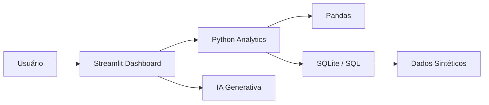

# Arquitetura

## Decisões

- **Pandas:** tratamento e agregação de dados.
- **SQL/SQLite:** demonstração de consultas analíticas e persistência local.
- **Streamlit:** interface simples para apresentar os indicadores.
- **IQR:** método simples e interpretável para detectar valores fora do padrão.
- **IA opcional:** interpreta somente indicadores já calculados pelo sistema.
